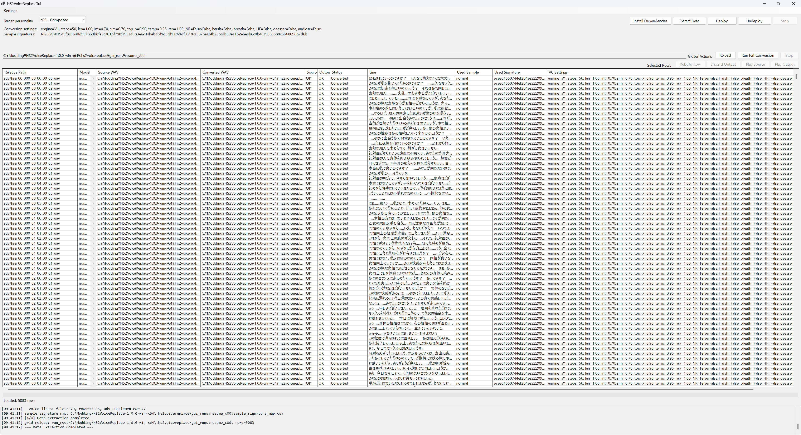

# HS2VoiceReplace

HS2VoiceReplace は、Honey Select 2 の既存ボイスを差し替えるデータ一式を作成し、配備するための Windows GUI ツールです。

元のゲーム音声を抽出し、用意したお手本音声へ Seed-VC で寄せて変換し、ゲームで使える形へ組み直して zipmod と実行用 DLL を出力します。

対象は `クール` や `ヤンデレ` のような既存性格です。新しい性格枠を追加するのではなく、既存性格向けの差し替えデータを作ります。

生成物はゲーム本体のファイルを直接書き換えず、`mods` と `BepInEx\plugins` を使って扱う前提です。GUI から性格ごとの配備と配備解除ができます。

英語版は `README.md` を参照してください。

## 前提環境

- `HS2VoiceReplaceGui.exe` を実行できる Windows 環境
- `.NET 8 Desktop Runtime`
- `mods` と `BepInEx\plugins` を使う Honey Select 2 環境
- 寄せたい声の、1〜30秒程度の短いお手本音声

変換に必要な依存の多くは、GUI からセットアップできます。

## クイックスタート

GitHub Releases から配布 zip をダウンロードし、`HS2VoiceReplaceGui.exe` から始めます。

- `HS2VoiceReplaceGui.exe`
  - ワークフロー全体をまとめるメイン画面
- 生成される `HS2_VoiceReplace.dll`
  - 配備した差し替えデータが使う実行用 DLL
- 生成される `HS2VoiceReplace_cXX_*.zipmod`
  - 性格ごとに作られる zipmod

1. `HS2VoiceReplaceGui.exe` を起動する
2. `HS2フォルダ` と対象性格を選ぶ
3. 依存セットアップを実行する
4. `データ抽出` を実行する
5. お手本音声を追加する
6. `試聴生成` と `全量変換` を進める
7. GUI から配備するか、生成物を手動配置する
   - `HS2_VoiceReplace.dll` は `BepInEx\plugins`
   - `HS2VoiceReplace_cXX_*.zipmod` は `mods`

画面例:

## Seed-VC 設定

おすすめの出発点:

- `v1`
- `DiffusionSteps = 50`
- それ以外の切り替え項目は `False` のまま始める

- `v1`
  - 元のしゃべり方に寄りやすい
  - 既存 HS2 ボイス差し替えではまず無難
- `v2`
  - 変化を強めに出したいとき向き

よく触る項目:

- `DiffusionSteps`
  - 上げるほど遅いが、きれいになることが多い
- `LengthAdjust`
  - セリフの長さを調整する
- `IntelligibilityCfgRate`
  - 発音の明瞭さを強める
- `SimilarityCfgRate`
  - お手本音声への寄せを強める
- `Temperature` / `TopP`
  - 結果の安定寄り / 変化寄りを調整する

## 補足

- このリポジトリから直接実行した場合、作業データの既定保存先はリポジトリ内の `.hs2voicereplace` です
- 作業データの保存先は GUI の基本設定から変更できます

## 開発情報

開発向けの情報はこの README には入れていません。

- 構成とビルド前提
  - `docs/DEVELOPMENT.md`
  - `docs/DEVELOPMENT_JA.md`
- 自動テスト
  - `docs/TESTING.md`
  - `docs/TESTING_JA.md`
- 保守運用メモ
  - `docs/MAINTAINER.md`
- ツール別メモ
  - `tools/HS2VoiceReplaceGui/README.md`
  - `tools/HS2VoiceReplaceGui/README_JA.md`
  - `tools/UabAudioClipPatcher/README.md`
  - `tools/UabAudioClipPatcher/README_JA.md`
  - `runtime/HS2VoiceReplace.Runtime/README.md`
  - `runtime/HS2VoiceReplace.Runtime/README_JA.md`
